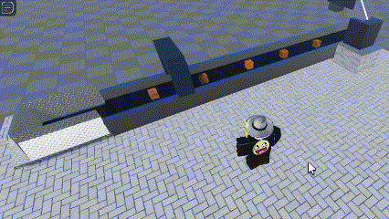
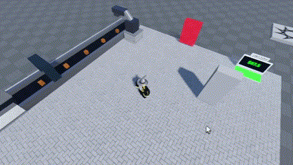

# RobloxTycoon
LUA, HyperCasual Test for Roblox

# Welcome to My Roblox Tycoon Game!

My Roblox tycoon game is currently in development and I am excited to share my progress with you! 

## About the Game

My tycoon game is set in a medieval world where players can build their own kingdoms, gather resources, and battle monsters. Players will start off with a small plot of land and must grow their kingdom by constructing buildings and upgrading their resources.

## Development Progress

I am currently the sole developer working on the project and I am dedicated to creating a fun and engaging gameplay experience. I am constantly testing and iterating on my designs to ensure that the game is challenging and enjoyable.

Here are some of the features I am currently working on:

- Building construction and resource management
- Combat system and enemy AI
- Quests and storyline

## Get Involved

I would love to hear your feedback and ideas as I develop my game. If you are interested in following my progress or contributing to the project, please check out my GitHub repository.

Thank you for your support, and I can't wait to share my game with you!```


## My Development Progress/







<h1 style="font-size: 20px;">Some changes-</h1>
Owner Door (This door doesn't let anybody let trought to your tycoon)<br>
Server System (Tycoon can hold up to 6 players)<br>
Purchase Button<br>


